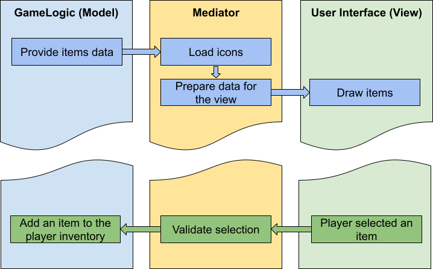

# Introduction

Fasten Up is the minimalist UI data binding framework for <a href="https://unity.com/">Unity</a>.

The main goal of Fasten Up is to provide a simple and fast way to bind game data to the UI components
without reflections and with minimal overhead. Source generator is used to generate the binding code,
so there is no runtime overhead.

## Key features

- Runtime data-binding for Unity components.
- No reflections.
- Multiple-properties binding.
- Mono & IL2CPP support.

## Main concepts

Fasten Up is based on the MVVM pattern. The main idea is to separate the UI from the data and logic.
The mediator is the main class that binds the data to the UI. It is responsible for the data synchronization between the model and the view.

Let's take a look at the simple example:

The player visits the shop. The shop has a list of items that can be bought. 
Each item has a price and an icon. The player has a certain amount of money. The player can buy an item if he has enough money.

1. The model is the data that we want to display in the UI. In our case, it is the list of items.
2. The view is the UI that displays the list of items.
3. The view model is the mediator that binds the model to the view. It is responsible for the download item icons, and preparing the data for the UI.
4. After the player buys an item, the data is validated, and the model is updated with the new item in inventory.

